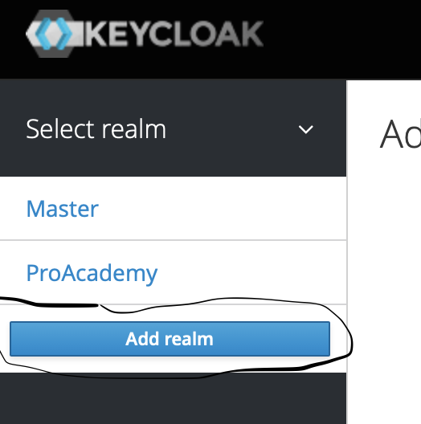
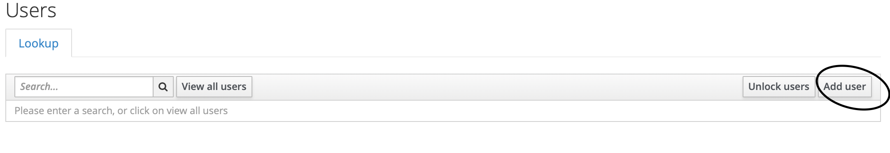
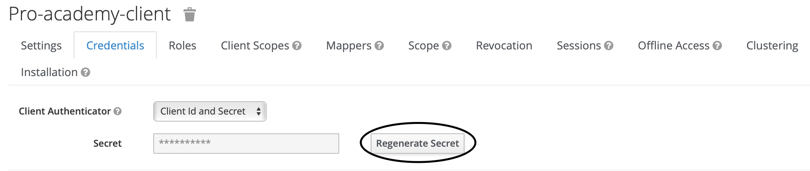
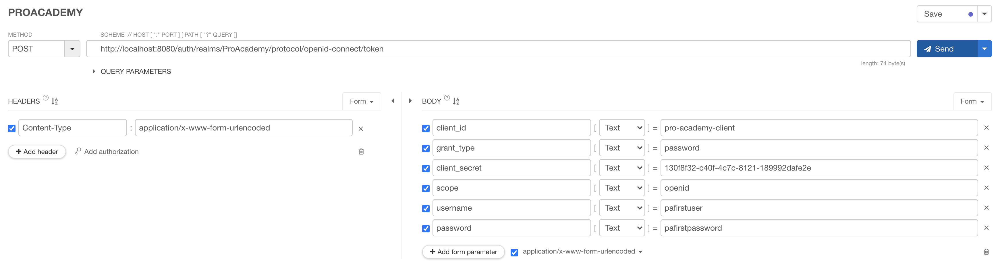
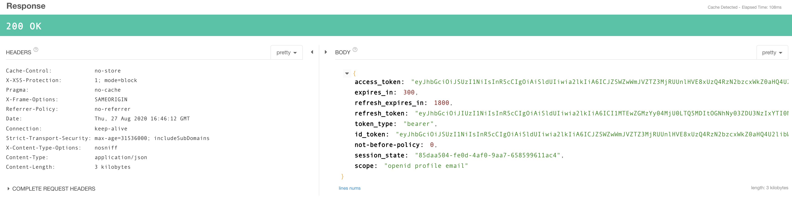
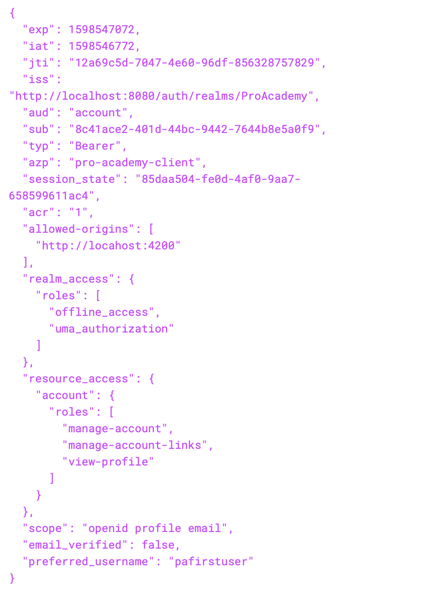

# pro-academy-keycloak-postgres

run docker-compose up

admin console: http://localhost:8080/auth/

user/password: admin/Pa55w0rd

### Import Pro-academy client
first needed to create a realm with exact name 'ProAcademy'

import pro-academy client with imports/realm-export.json 
- in case of 'Error! Client id '***' already exists' user override or skip existed clients

add user. example: pafirstuser/pafirstpassword

regenerate secret: 

### Check server with some clients e.g. curl/Talented Api Tester 
obtain token with right secret and user credentials:
 
#### curl
 curl -i -X POST \
                 -H "Content-Type:application/x-www-form-urlencoded" \
                 -d "client_id=pro-academy-client" \
                 -d "grant_type=password" \
                 -d "client_secret=6809a129-0910-4139-87fb-dd8a36628f73" \
                 -d "scope=openid" \
                 -d "username=pafirstuser" \
                 -d "password=pafirstpassword" \
               'http://localhost:8080/auth/realms/ProAcademy/protocol/openid-connect/token'

#### Talented API

response:

### Decode tokens

you can try decode obtained tokens on www.jwt.io

e.g. main part of access token should contains this information:

